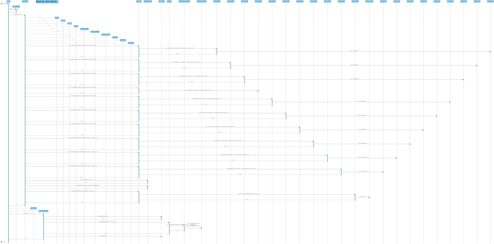

# JumpIN
A remade version of rabbit and foxes. Software Development Project 2019.

## Showcase

**Solver**

|   |  |
| --- | --- |
 
 The solver works by using a recursive algorithm which looks into theoretical moves up and until a certain threshold (user inputs this threshold). Afterwards, it will search the tree till it reaches the child nodes.
 * If the child node has 0 rabbits left to win the board, it is compared to the current best move. 
 * If the depth of the child node is less than the depth of the current best move, it becomes the new best move. 
 * The game will notify the user if no best move is found at the threshold.
 
 **Updated GUI**
 * Added icons to the taskbar and main frame
 * Cursor loads when solver is running
 * Centered frame on load and centered option panes
 * Formatted the main menu to be more visually pleasing
 * Created modern buttons
 * Reduced the highlighter size
 
**Undo/Redo GIFS use older GUI design**

 

 
 The Undo/Redo options use two stacks to store the history. 
 * Similar to how internet a internet history will work, the redo option is only available if the user hits undo. 
 * If a user then makes a new move, the option to redo is no longer available.

**Stress Test**

 

 
 In the above gif, we can see the solver take two thresholds. 
 * First it is initally given the value 2 and spews out 46 branches (# of combinations any piece can move for two moves). 
 * Afterwards, the fox is moved and it must be given a value of 3 to find a solution. 
 264 branches are created and the solution to solve the game is put in the console. 
 

 

 
A board with a 6 move solution is put under stress using our algorithm. It takes approximately 19 seconds to compute the solution with 3185463 branches created. This required approximately 3.5gb of ram. 

To furthur reduce the number of branches: 

* We should incorporate the fact that a piece should not move back to the position it came from. 

* We could also keep track of the smallest depth of an available solution and truncate any node that goes past this depth. 
 
To reduce the system memory: 

* Only small bits of information should be cloned. 
* In this scenario, the history of node is stored at the node. Instead, the node should only store the move it took from it's previous position. 
* In past iterations, a whole board object was cloned and required 12gb of system memory to compute a solution. 

**Features**

* BFS to find a solution to solve the board (similar to min/max algorithim but playing agaisnt itself)
* History of moves with a undo/redo option
* Highlights available moves for selected piece
* Fox can slide on either piece clicked and the correct amount of units moved
* **Visually stunning**

## Rules

JumpIN is played on a 5x5 board that consists of rabbit holes and tiles which you can move on. The game starts by positioning different pieces on the board. Each piece follows a unique set of movements which can be read below. The goal of the game is to have all of the rabbits into a rabbithole.

**Rabbit Holes**

There are five rabbit holes built into the board; one in each corner and one in the center of the board. Only rabbits can enter rabbit holes. Mushrooms can initially be placed on a rabbithole.

**Foxes**

There are a maximum of two foxes that are placed horizontally or vertically. Foxes can only slide along their respective orientation.

**Mushrooms**

There are a maximum of three mushrooms on the board. Mushrooms cannot be moved.

**Rabbits**

There are a maximum of three rabbits on the board. Rabbits can only hop over objects.

**For more information, view our game manual at: Deliverables/GameManual.txt**
## Progress
Current UML

 

 Current Sequence Diagram
 

 

 
## Copyright ©
JumpIN'™ is a game owned by ©SMART N.V. 

For more information visit: https://www.smartgames.eu/uk/one-player-games/jumpin

This project is for educational purposes only. Under the terms and conditions of ℗Fair use; it is not to be distributed for sales and or generating profit.
