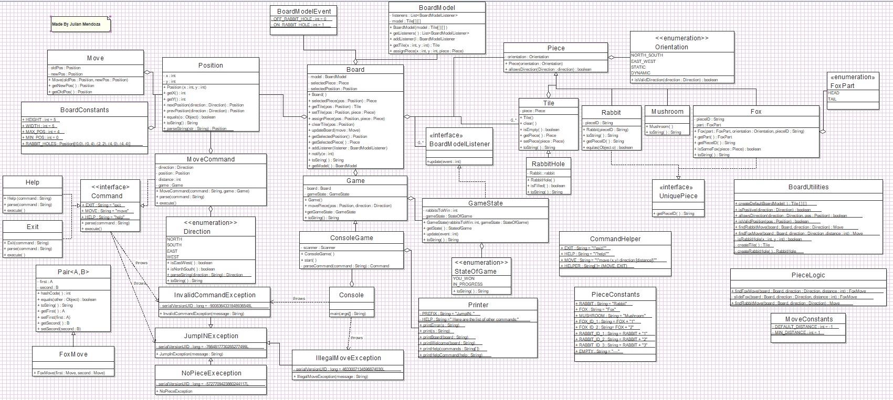

# JumpIN
A remade version of rabbit and foxes. Software Development Project 2019.
## Rules
JumpIN is played on a 5x5 board that consists of rabbit holes and tiles which you can move on. The game starts by positioning different pieces on the board. Each piece follows a unique set of movements which can be read below. The goal of the game is to have all of the rabbits into a rabbithole.

**Rabbit Holes**

There are five rabbit holes built into the board; one in each corner and one in the center of the board. Only rabbits can enter rabbit holes. Mushrooms can initially be placed on a rabbithole.

**Foxes**

There are a maximum of two foxes that are placed horizontally or vertically. Foxes can only slide along their respective orientation.

**Mushrooms**

There are a maximum of three mushrooms on the board. Mushrooms cannot be moved.

**Rabbits**

There are a maximum of three rabbits on the board. Rabbits can only hop over objects.
## Progress
**PLEASE WORK ON ISSUES IF POSSIBLE**

Current UML

 

 
## Copyright ©
JumpIN'™ is a game owned by ©SMART N.V. 

For more information visit: https://www.smartgames.eu/uk/one-player-games/jumpin

This project is for educational purposes only. Under the terms and conditions of ℗Fair use; it is not to be distributed for sales and or generating profit.
