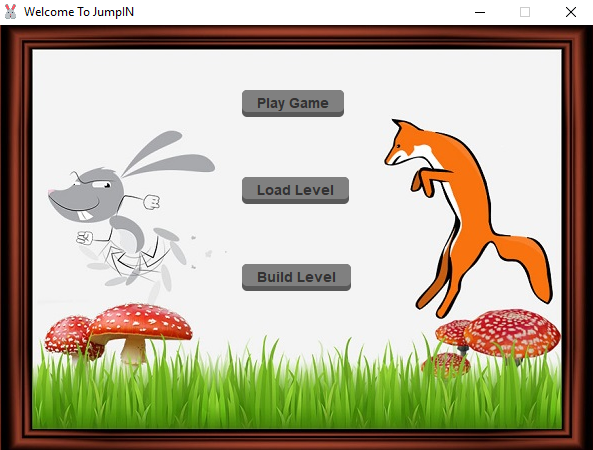
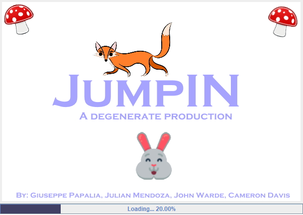
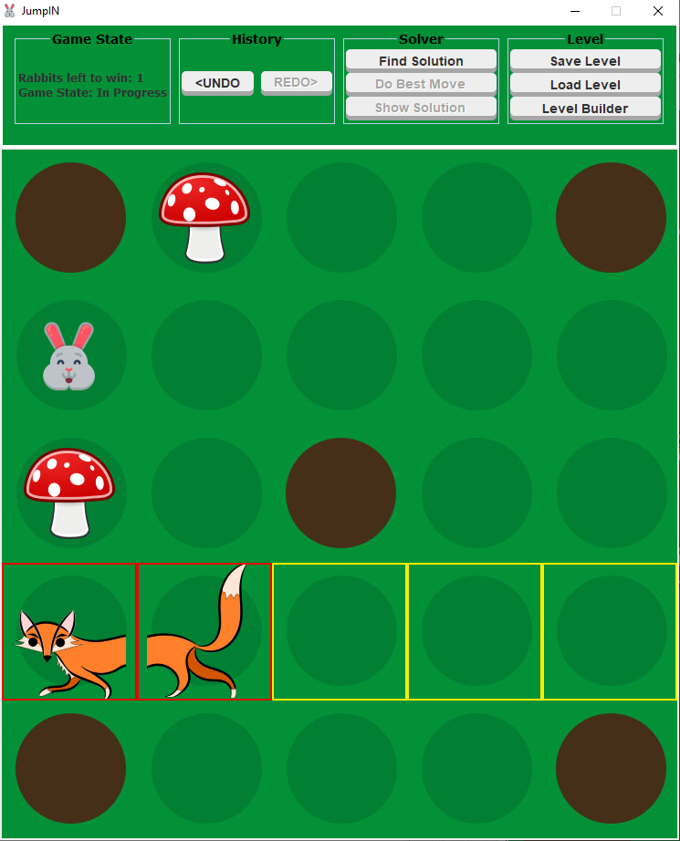
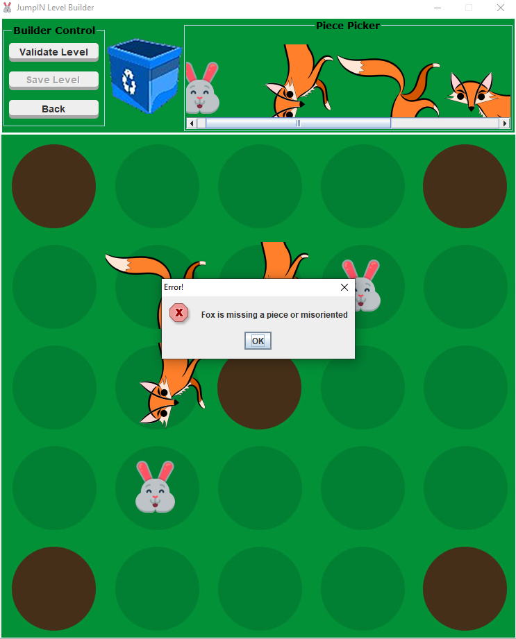

# JumpIN
A remade version of rabbit and foxes. Software Development Project 2019.

Authors: Giuseppe Pappalia, Julian Mendoza, John Warde, Cameron Davis

**Installation**
1.	Locate “MileStone4.zip” and extract it to anywhere you want
2.	Please make sure that images and levels is in the same directory as the game.jar file.
3.	Double-click game.jar to launch the game.
4.	Play the game! Choose a level to load by choosing the load level option in the main menu or generate a random level by clicking play.

**Features**

* User-friendly UI that highlights availalbe moves for selected piece
* History of moves with a undo/redo option
* Solver option to find the quickest solution to solve the game
* Interactive level builder with a validator option to determine if the game is solvable/playable
* Save/Load option using XML
* **Visually stunning**

**Screenshots**

|

Main menu of the JumpIN game. Presented on launch.

|

Loading screen between events.

|
| --- | --- |

|

Game play of the board game JumpIN.

|

Interactive GUI level builder with a validator.

|
| --- | --- |

## Rules

JumpIN is played on a 5x5 board that consists of rabbit holes and tiles which you can move on. The game starts by positioning different pieces on the board. Each piece follows a unique set of movements which can be read below. The goal of the game is to have all of the rabbits into a rabbithole.

**Rabbit Holes**

There are five rabbit holes built into the board; one in each corner and one in the center of the board. Only rabbits can enter rabbit holes. Mushrooms can initially be placed on a rabbithole.

**Foxes**

There are a maximum of two foxes that are placed horizontally or vertically. Foxes can only slide along their respective orientation.

**Mushrooms**

There are a maximum of three mushrooms on the board. Mushrooms cannot be moved.

**Rabbits**

There are a maximum of three rabbits on the board. Rabbits can only hop over objects.

**For more information, view our game manual at: Deliverables/GameManual.txt**
 
## Copyright ©
JumpIN'™ is a game owned by ©SMART N.V. 

For more information visit: https://www.smartgames.eu/uk/one-player-games/jumpin

This project is for educational purposes only. Under the terms and conditions of ℗Fair use; it is not to be distributed for sales and or generating profit.
